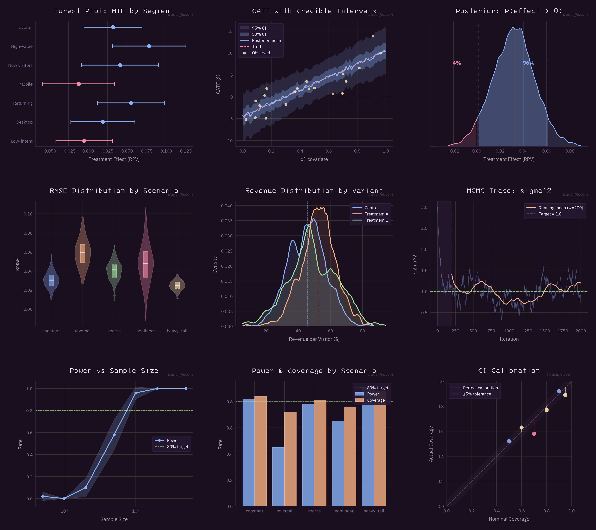
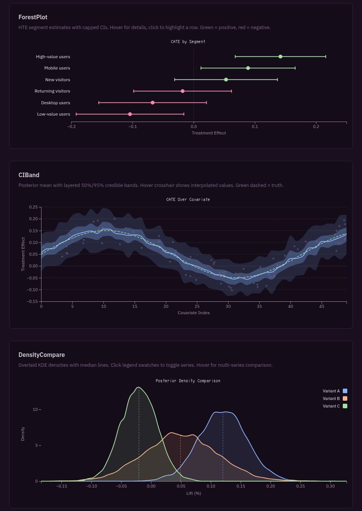

# trad-charts

Matplotlib + D3 chart library. Site-aligned purple chrome ([tradcliffe.com](https://tradcliffe.com)) with [Catppuccin Mocha](https://github.com/catppuccin/catppuccin) data accents.

**[Live demo — interactive D3 charts + palette reference](https://trrad.github.io/trad-charts/)**



## Install

```bash
uv add trad-charts --git https://github.com/trrad/trad-charts
```

## Usage

```python
from trad_charts import apply_theme, get_palette, watermark, TITLE_FONT

apply_theme()
pal = get_palette()

fig, ax = plt.subplots()
ax.plot(x, y, color=pal.blue)
ax.set_title("My Chart", **TITLE_FONT)
watermark(fig)
```

### Chart helpers

Opinionated helpers that enforce consistent style — labeled axes, semantic colors, credible intervals, capped error bars.

```python
from trad_charts import forest_plot, ci_band, distribution, power_curve, grouped_bar

# Forest plot with capped CIs, blue=positive / red=negative
forest_plot(ax, labels=labels, estimates=est, ci_lower=lo, ci_upper=hi,
            title="HTE by Segment", xlabel="Treatment Effect")

# Posterior mean with layered 50%/95% credible bands
ci_band(ax, x=x, mean=mean, std=std, truth=truth,
        title="CATE Estimates", xlabel="Covariate", ylabel="Effect ($)")

# Violin+box distribution comparison
distribution(ax, data=samples, labels=names,
             title="RMSE by Scenario", ylabel="RMSE")

# Power curve with target line, log scale
power_curve(ax, sample_sizes=ns, power=pwr, power_ci=ci,
            title="Power vs Sample Size")

# Grouped bar with automatic width calculation
grouped_bar(ax, categories=scenarios, groups={"Power": p, "Coverage": c},
            title="Metrics by Scenario", ylabel="Rate", target_line=0.80)
```

All helpers return the `Axes` for further customization.

### Palette

Purple chrome derived from [tradcliffe.com](https://tradcliffe.com) CSS variables. Data accents from Catppuccin Mocha, curated to an 8-color cycle that avoids purple (conflicts with chrome) and improves colorblind distinguishability.

```python
pal = get_palette()

# Surface/chrome (site-aligned purple)
pal.base        # #1a0f1f — background
pal.surface0    # #251730 — card/legend background
pal.text        # #e8e3ed — primary text
pal.subtext0    # #a297a8 — muted text

# Data accents (Catppuccin Mocha)
pal.blue        # #89b4fa — primary
pal.peach       # #fab387 — secondary (blue+orange = colorblind-safe pair)
pal.green       # #a6e3a1
pal.red         # #f38ba8
pal.yellow      # #f9e2af
pal.teal        # #94e2d5
pal.flamingo    # #f2cdcd
pal.sky         # #89dceb
```

### Fonts

Titles: **3270 Nerd Font Propo** (retro-technical). Body: **IBM Plex Sans** (clean sans-serif). Falls back gracefully if not installed.

### Charting rules

- Always label axes
- Always include descriptive titles
- Use correct axis scales (log for sample sizes, etc.)
- Show credible/confidence intervals where applicable
- Use semantic color for meaning (blue=positive, red=negative), cycle for categories
- Watermark every published chart

## D3 / Interactive

Bayesian posterior visualizations with drag-to-adjust CI bounds, threshold lines, and plain-English tooltips. Same palette, dark theme.

**[Live demo](https://trrad.github.io/trad-charts/)**



### Components

| Component | Description |
|---|---|
| `RidgeDotplot` | Multi-variant ridge comparison with draggable CI, dual $/% axes |
| `ForestPlot` | HTE segment estimates with capped CIs, click-to-highlight, semantic coloring |
| `CIBand` | Posterior mean with layered CI bands, crosshair hover, truth comparison |
| `DensityCompare` | Overlaid KDE densities with legend toggle, tail-probability tooltips |
| `QuantileDots` | Quantile dotplot with KDE violin overlay, threshold-split coloring |
| `DraggableCIBounds` | Interactive CI bound handles |
| `ThresholdLine` | Draggable threshold reference line |
| `Tooltip` | Context-aware tooltip with plain-English probability statements |
| `HintArea` | Progressive disclosure hints |
| `ContextMenu` | Right-click context menu |

### Usage

```js
import { RidgeDotplot } from 'trad-charts-d3';

const ridge = RidgeDotplot()
  .width(900)
  .numDots(20)
  .showViolin(true);

d3.select('#container')
  .datum({ variants, threshold: 0.10 })
  .call(ridge);
```

### Build from source

```bash
cd d3 && npm install && npm run build
```

Output: `d3/dist/trad-charts-d3.js` (ESM bundle, D3 as peer dep).

## License

MIT
